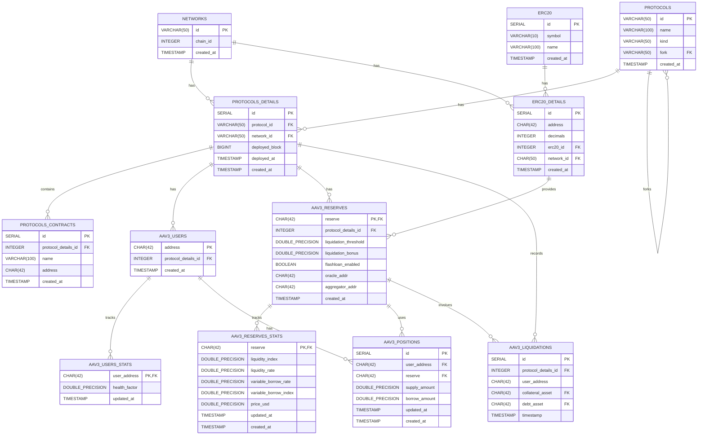

Standalone AaveV3 liquidation bot, unlikely to be profitable nowadays.

## Components:

- `contracts/` - contains example contract used to execute liquidations
- `src/` - contains the offchain logic responsible for tracking and managing liquidation opportunities
- `migrations/` - holds the database migrations

The offchain service is built with actix's [actor model](https://en.wikipedia.org/wiki/Actor_model) in mind.

The setup is abstracted enough to work on any and all Aave forks, on all EVM-compatible chains, so long as you know the deployment address of the protocol's:

- `Pool`
- `PoolAddressesProvider`
- `UiPoolDataProviderV3`

Simply create a new migration file in `migrations/`, copy [20240101010102_insert_val](./migrations/20240101010102_insert_val.sql) and adjust the values accordingly.

## Idiosyncrasies

- all reserves's real time value is tracked by listening for `AnswerUpdated`, emitted by Chainlink's price aggregators.
- users's open positions & exposure is kept both in-memory and in postgres for later usage
- the smart contract executing the liquidation relies on flashloan to execute the liquidation

# Example usage

- deploy the contract (perhaps locally through anvil fork `anvil --fork-url https://eth.merkle.io`)

- start postgres

```bash
docker-compose up -d postgres
```

run the offchain service

```bash
# the used pubkey & privkey are the default ones provided by anvil.
cargo r -- \
    --network ethereum --protocol aave_v3 \
    --ws-url=wss://eth.merkle.io \
    --account-pubkey=0xd8dA6BF26964aF9D7eEd9e03E53415D37aA96045 \
    --account-privkey=0xac0974bec39a17e36ba4a6b4d238ff944bacb478cbed5efcae784d7bf4f2ff80 \
    --bot-addr=0x95222290DD7278Aa3Ddd389Cc1E1d165CC4BAfe5
```

# Flow

The flow of execution goes like

```mermaid
sequenceDiagram

participant DB as DBActor
participant Fanatic as FanaticActor
participant Follower as FollowerActor
participant Executor as ExecutorActor

Fanatic ->> DB: GetProtocolDetailsId
Fanatic ->> DB: GetProtocolContracts
Fanatic ->> DB: GetReservesUsers

Fanatic -> Fanatic: init_reserves()

Fanatic ->> Follower: SendFanaticAddr
Fanatic ->> Follower: StartListeningForOraclePrices
Fanatic ->> Follower: StartListeningForEvents

rect rgb(30, 30, 30)
    Follower ->> Follower: listen_oracle_prices()
    Follower ->> DB: UpdateOraclePrice
    Follower ->> Fanatic: UpdateReservePrice
    Fanatic ->> Fanatic: verify health factors
    Fanatic ->> Fanatic: update in memory state
    Fanatic ->> Executor: liquidation request
    Executor --> Executor: verify opportunity is profitable
    Executor --> Executor: execute liquidation
end

rect rgb(30, 30, 30)
    Follower ->> Follower: listen_events()
    rect rgb(40, 40, 40)
        Follower ->> Fanatic: DoSmthWithLiquidationCall
        Fanatic ->> DB: InsertLiquidation
    end

    rect rgb(50, 50, 50)
        Follower ->> Fanatic: UpdateReserveUser
        Fanatic ->> Fanatic: verify health factor
        Fanatic ->> Fanatic: update in memory state
        Fanatic ->> Executor: liquidation request
        Executor --> Executor: verify opportunity is profitable
        Executor --> Executor: execute tx
    end

    rect rgb(60, 60, 60)
        Follower ->> DB: UpsertReserveStats
    end
end
```



# Database schema


